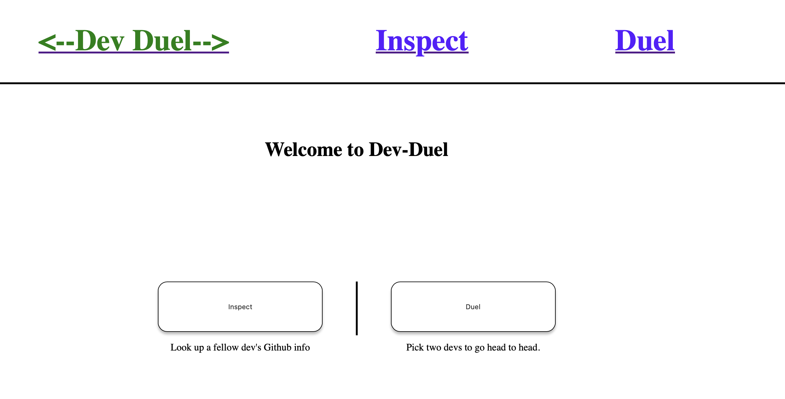

# Angular Dev-Duel

## Overview

Angular Dev-Duel is an engaging full-stack application that utilizes Angular for the frontend and Node.js with Express for the backend server. This project interfaces with GitHub's API to aggregate, transform, and display data from a user's GitHub profile and repositories. It's designed to be an educational challenge for students to develop practical skills in building full-stack applications.



### Features

- **User Profile Inspection**: Enter a GitHub username to fetch and display the user's profile data, including repositories, followers, and more.
- **Duel Mode**: Compare two GitHub users by entering their usernames, displaying their data side-by-side to determine a "winner" based on custom criteria
- **Responsive Design**: Crafted to provide an optimal viewing experience across a wide range of devices.

### Built With

- **Angular**: For crafting the dynamic and responsive client-side application.
- **Node.js and Express**: Used to create the backend API that interfaces with GitHub's API.
- **GitHub API**: For fetching the necessary user and repository data.

## Getting Started

These instructions will get you a copy of the project up and running on your local machine for development and testing purposes.

### Prerequisites

- Node.js (latest stable version)
- Angular CLI
- A GitHub token for increased API rate limits and improved testability

### Installation

1. **Clone the repository:**

   ```bash
   git clone https://github.com/yourusername/angular-dev-duel.git
   ```

2. **Navigate to the project directory:**

   ```bash
   cd angular-dev-duel
   ```

3. **Install the required npm packages:**

   ```bash
   npm install
   ```

4. **Start the development server:**
   ```bash
   ng serve
   ```

5. Set up your GitHub token by following the instructions in token-setup/README.md.

### Start the development servers

1. **To serve the API:**

   ```bash
   npm run serve-api
   ```

2. **To serve the static files:**

   ```bash
   npm run serve-static
   ```

3. **To run both concurrently**

   ```bash
   npm run serve-static
   ```

4. Navigate to http://localhost:4200/ to view the client application, and ensure the API is accessible via http://localhost:3000/api/health-check.

## Contributing

Contributions are what make the open-source community such an amazing place to learn, inspire, and create. Any contributions you make are greatly appreciated.

## License

This project is licensed under the MIT License.
